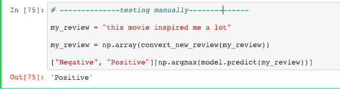

# Sentiment-Analysis

- Used LSTM to build the model.
- Movie review dataset is used to train the model.

## How to use:

- Go to last cell in Jupyter notebook and write your review.
- Run the cell to know the prediction. (refer to image below)

